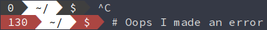

# contrail

(Somewhat) fast and configurable status prompter, inspired
by [powerline-shell](https://github.com/banga/powerline-shell)
and [bash-powerline](https://github.com/riobard/bash-powerline).

Customizations are made via a `config.toml` file.

**Disclaimer:** A large part of this program's functionality depends
on the user's shell and terminal emulator. Each shell and terminal
emulator supports different effects. Therefore, there may be some
options that *do not work* with your setup!

Works on Bash shells for Linux distros, *tentatively* also works on
ZSH shells and MacOS. Fish shell not supported.

Expect frequent breaking changes.

## Installation

You need the latest stable version
of [Rust](https://www.rust-lang.org) (install
with [rustup](http://doc.crates.io/index.html)). 

Ensure your `$PATH` includes `$HOME/.cargo/bin`.

Clone the repository and install with `cargo`:

```bash
git clone https://github.com/ben01189998819991197253/contrail ~/contrail
cd ~/contrail
cargo test && cargo install
```

In your `~/.bashrc`:

```bash
# ~/.bashrc
ps1() {
    PS1="$(contrail -e $? -c $HOME/path/to/config.toml) "
}

PROMPT_COMMAND="ps1; $PROMPT_COMMAND"
```

In your `~/.zshrc`

```bash
# ~/.zshrc
precmd() {
         PS1="$(contrail -e $? -z -c $HOME/path/to/config.toml) "
}
```

Restart/re-launch your terminal emulator. You'll know if it's working
correctly.

## Configuration

Configuration is done via a `config.toml` file. Contrail can be told
about this file's location with the `-c` flag.

Each part of the prompt is split up into "modules". A typical prompt
might have a "directory" module (shows the current working directory),
a "git" module (shows the current state of a git repo), and a "prompt"
module (changes color depending on the last exit code).

Global options belong under the `[global]` header. Module-specific
options belong under `[modules.module_name]`, so if you wanted to
change the separator for every module except for the directory module,
you could do:

```toml
[global]
separator = ">"

[modules.directory]
separator = ""   # Will take precedence over the global option
```

A list of every available option is in the `example_config.toml` file.

### Configuring module colors

Every module accepts at least two color options: `foreground` and
`background`. You can set them to *one* of the following strings:

```
"black", "bright_black", "red", "bright_red", "green",
"bright_green", "yellow", "bright_yellow", "blue", "bright_blue",
"purple", "bright_purple", "cyan", "bright_cyan", "white",
"bright_white"
```

So if I wanted to make the foreground of the "git" module green, with
a dark gray background, I would do:

```toml
[modules.git]
foreground = "bright_green"
background = "bright_black"
```

If no colors for a module are specified, `foreground` and `background`
will fall back to "bright_white" and "blue", respectively.

The color that you see will depend on how you have the colors of your
terminal set up. *In general*, the "bright" variants are better for
foreground colors, the regular ones for backgrounds.

`foreground` and `background` also accept any number from 0 to 255, as
detailed
on
[this chart](https://upload.wikimedia.org/wikipedia/commons/1/15/Xterm_256color_chart.svg). I
recommend you just stick to the color names though (which are
literally just aliases to colors 0-15), as it's more likely your
terminal emulator will support them. An example:

```toml
[modules.git]
foreground = "15"   # Same thing as "bright_white"
background = "214"  # A sort-of peachy color
```

### Configuring font styles

Every module accepts a `style` option that will (you guessed it) style
the text accordingly. Be aware that your terminal emulator might not
support all of these effects.

```
"bold", "dimmed", "italic", "underline", "blink", "reverse",
"hidden", "strikethrough"
```

An example:

```toml
[global]
style = "bold"    # Everything is bold!

[modules.prompt]
style = "italic"  # But my prompt is in italics!
```

For now only one style can be active at a time (i.e, your text can't
be both bold AND italicized).

### Custom modules

There are three ways to get your own text into a module:

1. Hack on the source code and add it (and please submit a pull request if you do!)

2. Override an already-existing module by passing `output = "some string"` in the config

3. "Create" a new module with a new heading, such as `[modules.my_module_name]`

An example of 2 and 3:

```toml
[global]
modules = ["my_custom_module", "directory", "prompt"] # Notice how "my_custom_module" is included

[modules.directory]
output = "$(pwd)"   # This will get evaluated and override the old output

[modules.my_custom_module]
output = "Hello, world!"
# I can do additional customization here.
# By default the background color will be "blue"
```

**Do note** that due to the way the `$PS1` variable is updated, it's
possible to run arbitrary shell commands. So don't do anything stupid
like setting `output = "$(rm -rf ~/*)"`.

## Screenshots

All screenshots with their respective config files can be found in the
`examples` folder.

A basic setup:


Slightly more fancy, with powerline symbols:




I had to retouch the screenshots in GIMP to remove some antialiasing
issues exacerbated by my powerline font not aligning correctly. I
don't recommend using powerline symbols, although if it works for you
go for it!

## Contributing

...is welcomed! Please submit any issues and pull requests, although
do run your code through `rustfmt` first, please.

## Compatibility

 - [x] Functions on Linux
   - [x] Works with Bash
   - [x] Works with ZSH
 - [ ] Functions on MacOS

## Other

#### "Help, when I try to run contrail it just crashes!"

Make *100% sure* your config file is syntactically correct
TOML. Otherwise, file an issue or dig into the source code and try to
fix it :)
